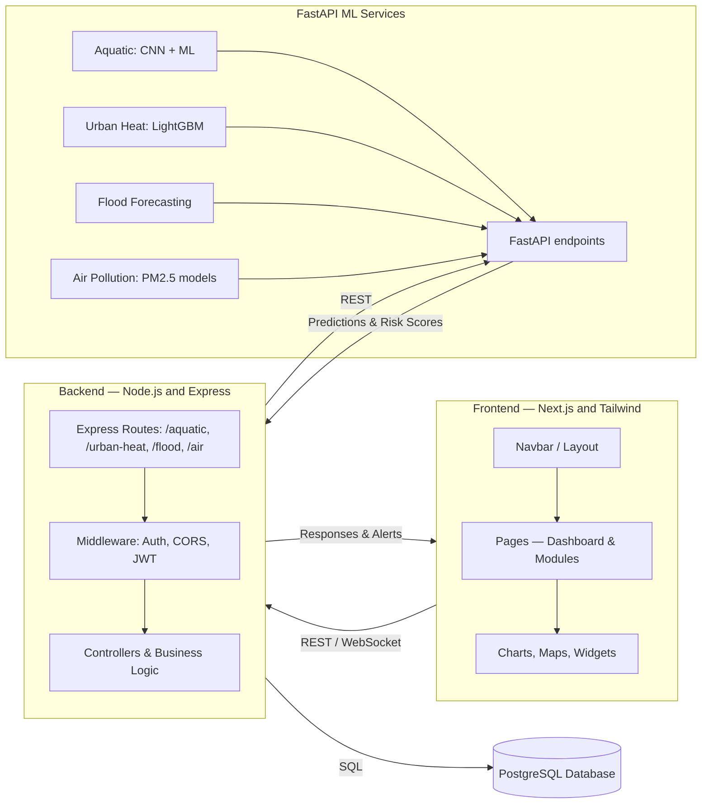

# EcoGuard-AI
🌿 Environmental Risk and Resource Management AI System

## Project overview
EcoGuard-AI integrates multiple environmental monitoring and prediction systems into a single web application:
- IoT-enhanced aquatic ecosystem health monitoring
- Urban heat risk early warning system
- Flood prediction & alert system
- Air pollution & vehicle emissions tracking

Frontend: Next.js + Tailwind CSS  
Backend: Node.js + Express (APIs) + PostgreSQL (data)  
ML services: FastAPI (model inference)

The platform enables real-time monitoring, predictive analysis, and actionable alerts for stakeholders (government agencies, researchers, and the public).

---

## Architecture (diagram)
The diagram below uses Mermaid for a clearer flow. GitHub's Markdown renderer supports Mermaid diagrams in public repositories. If Mermaid does not render in your environment, use a Mermaid live editor (https://mermaid.live/) or replace this section with an SVG/PNG.



---

## Technologies & Dependencies

| Layer    | Technology                               | Purpose                       |
| -------- | ---------------------------------------- | ----------------------------- |
| Frontend | Next.js                                  | React-based SSR/SPA framework |
| Frontend | Tailwind CSS                             | Styling & responsive design   |
| Frontend | React Charts / Leaflet Maps              | Interactive dashboards        |
| Backend  | Node.js + Express                        | REST API framework            |
| Backend  | PostgreSQL                               | Relational database           |
| ML       | FastAPI                                  | Model serving                 |
| ML       | LightGBM / XGBoost / CNN / RandomForest  | Predictive models             |
| Alerts   | Twilio / WhatsApp API                    | SMS & WhatsApp alerts         |
| Auth     | JWT                                      | Secure authentication         |

---

## Folder structure
A suggested project layout for clarity — adjust if frontend/backend are split across separate repos:

```
smart-environment-platform/
├── frontend/               # Next.js + Tailwind SPA
│   ├── pages/              # Pages for dashboard & modules
│   ├── components/         # Navbar, charts, maps, widgets
│   ├── public/             # Static assets (images, svgs)
│   ├── styles/             # Tailwind + custom CSS
│   └── package.json
├── backend/                # Node.js + Express + PostgreSQL
│   ├── src/
│   │   ├── controllers/
│   │   ├── routes/
│   │   ├── models/
│   │   ├── middleware/
│   │   └── server.js
│   ├── ml_services/        # FastAPI model clients or wrappers
│   └── package.json
├── ml_services/            # (optional separate service repo or folder)
│   ├── aquatic/
│   ├── urban_heat/
│   └── flood/
├── scripts/                # deployment, db migrations, helpers
├── .env.example
└── README.md
```

---

## Features
- Real-time aquatic ecosystem monitoring (IoT sensor integration)
- Urban heat risk prediction with multi-day forecasts
- Flood prediction with alerts and multi-language support
- Air pollution & vehicle emission tracking (PM2.5 forecasting)
- Interactive dashboards with charts, maps, and real-time alerts
- SMS/WhatsApp alerting for high-risk conditions

---

## Getting Started (local development)
Requirements: Node.js 18+, Python 3.11+, PostgreSQL 16+, npm or yarn.

1. Clone the repository (if combined repo):
   ```bash
   git clone https://github.com/<owner>/EcoGuard-AI.git
   cd EcoGuard-AI
   ```

   If frontend and backend are separate repositories, clone each into sibling directories.

2. Frontend:
   ```bash
   cd frontend
   npm install
   npm run dev
   ```
   Default: http://localhost:3000

3. Backend:
   ```bash
   cd ../backend
   npm install
   cp .env.example .env
   # Edit .env to configure your PostgreSQL connection and other secrets
   npm run dev
   ```

4. ML services (FastAPI):
   Each ML service may live under `ml_services/` and include its own dependencies.
   ```bash
   cd ../ml_services/<service-folder>
   python -m venv venv
   source venv/bin/activate
   pip install -r requirements.txt
   uvicorn main:app --reload --port 8001
   ```

5. Database migrations:
   - Run database migrations according to the backend tooling used (e.g., Sequelize, Knex, TypeORM).
   - Example (Sequelize CLI):
     ```bash
     npx sequelize-cli db:migrate
     ```

Notes:
- Use `.env.example` as a template for required environment variables.
- Adjust ports and addresses in the frontend/backend config to match local setup.

---

## Running with Docker (example)
If you add Dockerfiles and docker-compose, a typical flow:
```bash
docker-compose up --build
```
Provide service definitions for frontend, backend, ml_services, and postgres in `docker-compose.yml`.

---

## Testing & CI
- Add unit and integration tests for backend and frontend.
- Configure GitHub Actions for CI:
  - Linting (ESLint, style checks)
  - Unit tests
  - Build check for Next.js

---

## Contributing
Contributions welcome. Please:
1. Fork the repository
2. Create a feature branch: `git checkout -b feature/my-feature`
3. Commit your changes and push
4. Open a Pull Request describing your changes and tests

Follow/add a CONTRIBUTING.md to document branching, testing, and PR guidelines.

---

## Troubleshooting Mermaid rendering
- Common error: malformed node labels or missing/extra brackets.
- Use quoted labels like `Node["label text"]` to avoid parsing issues.
- If your environment doesn't render Mermaid, replace diagram with a generated SVG/PNG or link to a Mermaid live preview.

---

## License
MIT License

---

If you'd like, I can:
- Commit this README.md update to the repository,
- Replace the Mermaid diagram with a generated SVG/PNG and update the README to reference the image,
- Or split the README into separate docs (CONTRIBUTING.md, ARCHITECTURE.md).
