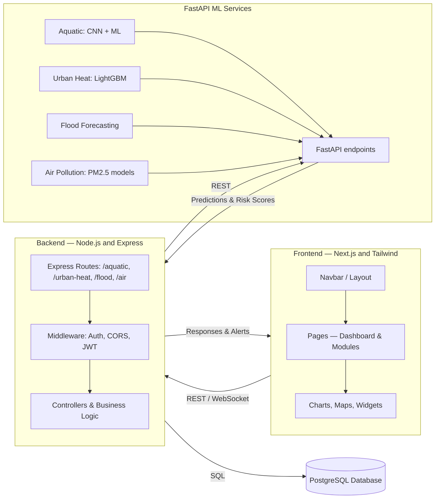

# EcoGuard-AI
🌿 Environmental Risk and Resource Management AI System
🔗 GitHub Repository: [https://github.com/shamalgodawela/EcoGuard-AI.git](https://github.com/shamalgodawela/EcoGuard-AI.git)

EcoGuard-AI is a multi-module environmental intelligence platform that combines IoT data ingestion, machine learning services, and real-time dashboards to support risk detection and response.

## Project overview
EcoGuard-AI integrates multiple environmental monitoring and prediction capabilities into one system:
- Coral reef and aquatic ecosystem health monitoring
- Urban heat risk prediction and Alert System
- Flood risk monitoring and Alert System
- Air Quality Monitoring and Alert System

Frontend: Next.js + Tailwind CSS  
Backend: Node.js + Express (APIs) + PostgreSQL (data)  
ML services: FastAPI (model inference)

The platform is designed for actionable decision support across agencies, researchers, and communities through data visualization, forecasting, and notifications.

---

## Key capabilities

- Real-time dashboards for flood, heat, air quality, and coral modules
- IoT sensor data ingestion and historical trend analysis
- Heat-risk prediction pipeline with scheduled weather data updates
- Coral image inference powered by deep learning (PyTorch)
- Alert subscription workflows (OTP-based subscribe/unsubscribe flows)
- WebSocket-backed live updates for selected risk modules
- AI-assisted chat endpoints in both backend and Python inference services

---

## Architecture (diagram)
The diagram below uses Mermaid for a clearer flow. GitHub's Markdown renderer supports Mermaid diagrams in public repositories. If Mermaid does not render in your environment, use a Mermaid live editor (https://mermaid.live/) or replace this section with an SVG/PNG.


```mermaid
flowchart LR
  subgraph FE["Frontend — Next.js and Tailwind"]
    FE_Nav["Navbar / Layout"]
    FE_Pages["Pages — Dashboard & Modules"]
    FE_Components["Charts, Maps, Widgets"]
    FE_Nav --> FE_Pages
    FE_Pages --> FE_Components
  end

  subgraph BE["Backend — Node.js and Express"]
    BE_Routes["Express Routes: /aquatic, /urban-heat, /flood, /air"]
    BE_MW["Middleware: Auth, CORS, JWT"]
    BE_Controllers["Controllers & Business Logic"]
    BE_Routes --> BE_MW --> BE_Controllers
  end

  DB[(PostgreSQL Database)]

  subgraph ML["FastAPI ML Services"]
    ML_Aquatic["Aquatic: CNN + ML"]
    ML_Heat["Urban Heat: LightGBM"]
    ML_Flood["Flood Forecasting"]
    ML_Air["Air Pollution: PM2.5 models"]
    ML_API["FastAPI endpoints"]
    ML_Aquatic & ML_Heat & ML_Flood & ML_Air --> ML_API
  end

  FE -->|REST / WebSocket| BE
  BE -->|SQL| DB
  BE -->|REST| ML_API
  ML_API -->|Predictions & Risk Scores| BE
  BE -->|Responses & Alerts| FE
```

---

## Technology stack

| Layer | Technologies |
| --- | --- |
| Frontend | Next.js 16, React 19, TypeScript, Tailwind CSS, Leaflet, Recharts |
| Backend | Node.js, Express, Sequelize, PostgreSQL, JWT, WebSocket (`ws`) |
| Python ML Services | FastAPI, pandas, scikit-learn, LightGBM, APScheduler, PyTorch |
| AI Integrations | Google Generative AI SDK, OpenAI API |
| Notifications | OTP-based subscriber management, SMS integration service hooks |

---

## Folder structure
A high-level structure of this repository:

```text
EcoGuard-AI/
├── Frontend/                          # Next.js frontend
│   ├── app/
│   │   ├── Pages/
│   │   │   ├── Coral_reef/            # Coral dashboards, auth/report pages
│   │   │   ├── Heat_risk/             # Heat maps, prediction, alerts, chatbot
│   │   │   ├── Flood_Risk/            # Flood dashboard, alerts, notifications
│   │   │   └── air_quality/           # Air dashboard, reports, subscriptions
│   │   ├── Header/
│   │   └── Footer/
│   ├── public/                        # Static assets and geojson files
│   └── package.json
├── Backend/                           # Express + Sequelize backend
│   ├── Config/                        # DB configuration
│   ├── Controllers/                   # Route business logic
│   ├── Models/                        # Sequelize models
│   ├── Routes/                        # API route definitions
│   ├── Middleware/                    # Auth and request middleware
│   ├── Services/                      # OTP/SMS and utility services
│   ├── Utils/
│   ├── seed/
│   ├── Server.js                      # Main app/server entry
│   └── package.json
├── python_api/                        # Coral inference service (FastAPI + PyTorch)
│   ├── api.py
│   └── requirements.txt
├── python_api_heat_risk/              # Heat prediction service (FastAPI + LightGBM)
│   ├── api.py
│   ├── config/
│   ├── services/
│   ├── utils/
│   ├── data/
│   ├── train_model.py
│   └── requirements.txt
└── README.md
```

---

## Module highlights

### 1) Heat risk module
- Prediction APIs under `/api/predictions`
- Backend heat warning endpoint `/api/heat-warning` with cache refresh cycle
- Python heat service with scheduled dataset updates and forecasting pipeline

### 2) Flood risk module
- Measurement and float-sensor APIs under `/api/flood` and `/api/float`
- Alert user management under `/api/alert-users`
- WebSocket event broadcasting for live UI updates

### 3) Air quality module
- Pollution APIs under `/api/pollution`
- Sensor and reporting workflows integrated into dashboard pages
- Subscription endpoints for notifications under `/api/subscribe/*` and `/api/unsubscribe/*`

### 4) Coral & water quality module
- Coral auth and report routes
- Water quality sensor endpoints for pH, turbidity, and temperature
- Python `python_api` service for coral bleaching inference + contextual AI suggestions

---

## Getting Started (local development)
Requirements:
- Node.js 18+
- npm 9+
- Python 3.10+
- PostgreSQL 14+ (16+ recommended)

1. Clone repository
   ```bash
   git clone https://github.com/<owner>/EcoGuard-AI.git
   cd EcoGuard-AI
   ```

2. Run frontend
   ```bash
   cd Frontend
   npm install
   npm run dev
   ```
   Frontend URL: `http://localhost:3000`

3. Run backend
   ```bash
   cd ../Backend
   npm install
   npm run dev
   ```
   Backend URL: `http://localhost:5000`

4. Run heat-risk FastAPI service
   ```bash
   cd ../python_api_heat_risk
   python -m venv venv
   venv\Scripts\activate
   pip install -r requirements.txt
   uvicorn api:app --reload --port 8001
   ```

5. Run coral inference FastAPI service
   ```bash
   cd ../python_api
   python -m venv venv
   venv\Scripts\activate
   pip install -r requirements.txt
   uvicorn api:app --reload --port 8002
   ```

6. Configure environment variables
   - Create `Backend/.env` for DB and auth settings
   - Create `python_api/.env` with `OPENAI_API_KEY` for coral suggestion/chat routes
   - Adjust service URLs/ports if running on non-default ports

---

## Backend API overview

Core route groups currently include:
- `/api/auth` (heat auth)
- `/api/predictions` (heat predictions)
- `/api/heat-warning` and `/api/heat-warning` route group
- `/api/flood`, `/api/float` (flood and float sensor data)
- `/api/alert-users` (flood alert recipients and subscription management)
- `/api/pollution` (air pollution data and chat endpoint)
- `/api/water-quality` (pH, turbidity, water temperature)
- `/api/reports`, `/api/coral-auth`, `/api/sensors`

Backend root check:
- `GET /` returns API status payload

---

## Data and model flow

- Heat-risk service fetches historical/forecast weather signals and blends sensor context for prediction features.
- Prediction artifacts include heat index and classified risk levels.
- Backend consumes and serves processed risk data to UI dashboards and alert workflows.
- Coral service performs image classification (`healthy_corals`, `bleach_1_40`, `bleach_40_100`) and generates context-aware guidance.

---

## Scripts

### Frontend (`Frontend/package.json`)
- `npm run dev`
- `npm run build`
- `npm run start`
- `npm run lint`

### Backend (`Backend/package.json`)
- `npm run dev`
- `npm start`

---

## Deployment notes

- Deploy each service independently: frontend, backend, `python_api`, and `python_api_heat_risk`.
- Use managed PostgreSQL for production durability and backups.
- Put backend and Python services behind a reverse proxy/API gateway.
- Restrict CORS origins for production domains.
- Run CI checks for lint/build/test before release.

---

## Contributing

1. Fork repository
2. Create branch: `git checkout -b feature/my-feature`
3. Commit and push changes
4. Open a Pull Request with clear testing notes

Follow/add a CONTRIBUTING.md to document branching, testing, and PR guidelines.

---

## Troubleshooting

- If backend cannot connect, verify PostgreSQL credentials and host/port in `Backend/.env`.
- If heat-risk predictions fail, ensure model `.pkl` files and CSV data paths exist in `python_api_heat_risk`.
- If coral service fails at startup, ensure `python_api/.env` contains `OPENAI_API_KEY` and model file `my_model.pth` is present.
- If CORS errors occur, verify frontend origin (`http://localhost:3000`) matches backend and FastAPI CORS settings.

---

## License
MIT License
