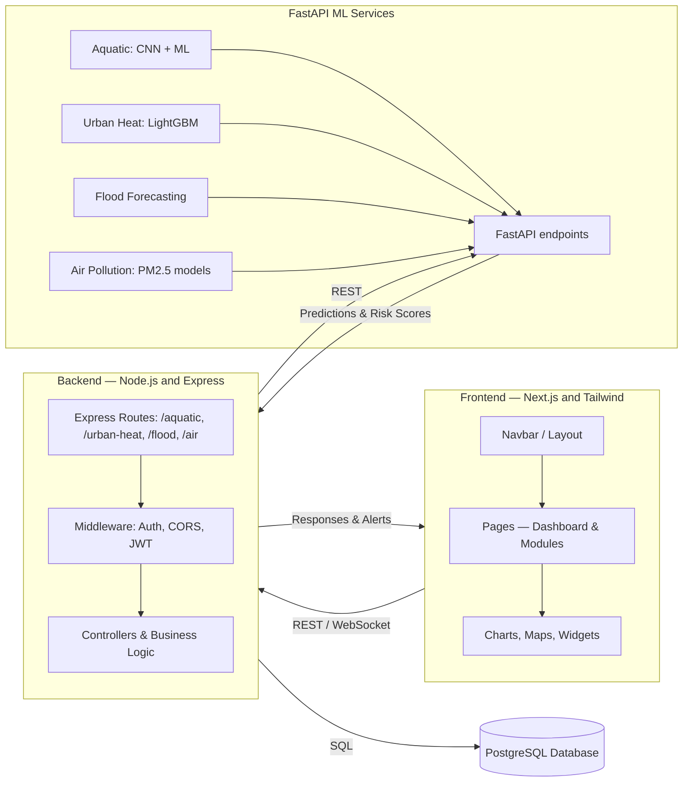

# EcoGuard-AI

**Environmental Risk and Resource Management AI System - Final Year Research Project**

Faculty of Computing, **SLIIT** (Sri Lanka Institute of Information Technology) ,Sri Lanka

An AI and IoT integrated platform for predictive environmental risk analysis, real-time monitoring, and sustainable resource management across flood, air quality, urban heat, and coral reef domains.

**Repository:** [https://github.com/shamalgodawela/EcoGuard-AI](https://github.com/shamalgodawela/EcoGuard-AI)

---

## Table of contents

- [Abstract](#abstract)
- [Research objectives](#research-objectives)
- [System modules](#system-modules)
- [IoT integration](#iot-integration)
- [Architecture](#architecture)
- [Technology stack](#technology-stack)
- [Repository structure](#repository-structure)
- [Prerequisites](#prerequisites)
- [Installation and setup](#installation-and-setup)
- [Environment variables](#environment-variables)
- [Running the system](#running-the-system)
- [API overview](#api-overview)
- [Machine learning components](#machine-learning-components)
- [Research significance](#research-significance)
- [Project information](#project-information)
- [Troubleshooting](#troubleshooting)
- [License](#license)

---

## Abstract

<div align="justify">

Sri Lanka faces mounting environmental challenges including coral reef bleaching, recurrent flooding, escalating urban heat stress, and deteriorating air quality all deeply interconnected yet largely monitored in isolation. Traditional approaches rely on manual observation and fragmented sensor networks, limiting real-time response and effective cross-domain environmental analysis.

To address these critical gaps, this study presents an integrated AI-powered Environmental Intelligence System designed to proactively monitor and manage key environmental conditions across Sri Lanka. The system combines IoT multi-sensor networks with advanced machine learning and deep learning techniques to continuously collect, process, and analyze environmental data in real time. It delivers intelligent risk classification, early warnings, and actionable insights through a unified web dashboard, SMS alert mechanisms, and an LLM-powered chatbot interface that supports informed decision-making.

Prototype evaluation confirms high predictive accuracy and reliable real-time performance, demonstrating the system's potential as a scalable and proactive solution for national environmental risk management.

</div>

---

## Research objectives

This project was developed as a **Final Year Research (FYP)** deliverable with the following goals:

1. Develop predictive models for environmental risk assessment
2. Integrate real-time IoT sensor data with AI analytics
3. Provide early warnings for floods, heat waves, and air pollution
4. Support sustainable resource management and policy decisions
5. Improve resilience of urban and coastal ecosystems

---

## System modules

All four modules are **IoT-enabled**: field devices stream sensor readings to the Node.js backend in real time; dashboards, ML services, and alert workflows consume that data for monitoring, prediction, and notifications.

| Module | IoT sensors & devices | Key capabilities |
| --- | --- | --- |
| **Coral Reef Health Monitoring Module** | pH, turbidity, and water-temperature probes (inland river monitoring) | EfficientNet-B0 coral bleaching classification, live water-quality fusion, role-based AI guidance |
| **Air Quality Monitoring & Health Advisory Module** | MQ-7, MQ-135, ENS160, DHT11 (CO, CO₂, NH₃, PM2.5, temperature/humidity) | Real-time pollution dashboards, health advisories, OTP-based alert subscriptions |
| **Flood Risk Monitoring & Alert Module** | Ultrasonic water-level sensors and ESP32-based float sensors | Live level tracking, WebSocket updates, threshold-based SMS alerts |
| **Urban Heat Risk Prediction & Alert Module** | IoT temperature/humidity nodes (heat-index and risk-level reporting) | LightGBM multi-step forecasting, weather API enrichment, heat warnings and SMS alerts |

---

## IoT integration

EcoGuard-AI is built around a **shared IoT data pipeline** used by every research module:

```text
IoT devices (ESP32 / sensor nodes)
        ↓  HTTP POST / live ingest
Node.js backend (Express + PostgreSQL)
        ↓  REST API + WebSocket
Next.js dashboards, ML services, SMS & chatbot alerts
```

| Module | Data ingested from IoT | Backend endpoints (examples) |
| --- | --- | --- |
| Coral Reef Health Monitoring Module | pH, turbidity, water temperature | `/api/water-quality/*` |
| Air Quality Monitoring & Health Advisory Module | CO, CO₂, NH₃, dust/PM, ambient conditions | `/api/air/*`, `/api/pollution` |
| Flood Risk Monitoring & Alert Module | Water level (ultrasonic), float status (ESP32) | `/api/flood`, `/api/float` |
| Urban Heat Risk Prediction & Alert Module | Temperature, humidity, computed heat index | `/api/sensors` |

Live flood and float updates are pushed to the frontend via **WebSocket**; other modules refresh through REST polling and cached prediction jobs.

---

## Architecture

The diagram below uses Mermaid for a clearer flow. GitHub's Markdown renderer supports Mermaid diagrams in public repositories. If Mermaid does not render in your environment, use a [Mermaid live editor](https://mermaid.live/) or replace this section with an SVG/PNG.


```mermaid
flowchart LR
  subgraph FE["Frontend — Next.js and Tailwind"]
    FE_Nav["Navbar / Layout"]
    FE_Pages["Pages — Dashboard & Modules"]
    FE_Components["Charts, Maps, Widgets"]
    FE_Nav --> FE_Pages
    FE_Pages --> FE_Components
  end

  subgraph BE["Backend — Node.js and Express"]
    BE_Routes["Express Routes: /aquatic, /urban-heat, /flood, /air"]
    BE_MW["Middleware: Auth, CORS, JWT"]
    BE_Controllers["Controllers & Business Logic"]
    BE_Routes --> BE_MW --> BE_Controllers
  end

  DB[(PostgreSQL Database)]

  subgraph ML["FastAPI ML Services"]
    ML_Aquatic["Aquatic: CNN + ML"]
    ML_Heat["Urban Heat: LightGBM"]
    ML_Flood["Flood Forecasting"]
    ML_Air["Air Pollution: PM2.5 models"]
    ML_API["FastAPI endpoints"]
    ML_Aquatic & ML_Heat & ML_Flood & ML_Air --> ML_API
  end

  FE -->|REST / WebSocket| BE
  BE -->|SQL| DB
  BE -->|REST| ML_API
  ML_API -->|Predictions & Risk Scores| BE
  BE -->|Responses & Alerts| FE
```

**Service ports (local development)**

| Service | Default URL | Purpose |
| --- | --- | --- |
| Frontend | `http://localhost:3000` | Web dashboards and landing page |
| Backend | `http://localhost:5000` | APIs, auth, database, WebSocket |
| Heat ML (`python_api_heat_risk`) | `http://localhost:8000` | Urban heat predictions |
| Coral ML (`python_api`) | `http://localhost:8001` | Coral image inference and chat |

---

## Technology stack

| Layer | Technologies |
| --- | --- |
| IoT & edge | ESP32 microcontrollers, ultrasonic/float flood sensors, air-quality gas sensors (MQ-7, MQ-135, ENS160), DHT11, pH/turbidity/temperature water probes |
| Frontend | Next.js 16, React 19, TypeScript, Tailwind CSS 4, Leaflet, Recharts |
| Backend | Node.js, Express 5, Sequelize, PostgreSQL, JWT, WebSocket (`ws`) — central IoT ingest hub |
| ML - heat | FastAPI, pandas, scikit-learn, LightGBM, APScheduler |
| ML - coral | FastAPI, PyTorch, torchvision (EfficientNet-B0), OpenAI API |
| Notifications | OTP flows, Text.lk SMS integration |
| AI assistants | OpenAI API, Google Generative AI SDK (backend modules) |

---

## Repository structure

```text
EcoGuard-AI/
├── Frontend/                    # Next.js application
│   ├── app/
│   │   ├── page.tsx             # Research landing page
│   │   └── Pages/
│   │       ├── Flood_Risk/      # Flood dashboards, alerts, safety
│   │       ├── air_quality/     # Air monitoring and subscriptions
│   │       ├── Heat_risk/       # Heat maps, predictions, chatbot
│   │       └── Coral_reef/      # Coral dashboards, analysis, auth
│   └── package.json
├── Backend/                     # Express API and PostgreSQL models
│   ├── Config/                  # Sequelize database config
│   ├── Controllers/
│   ├── Models/
│   ├── Routes/
│   ├── Services/                # OTP, SMS utilities
│   ├── Middleware/
│   ├── seed/
│   └── Server.js
├── python_api/                  # Coral bleaching inference (PyTorch)
│   ├── api.py
│   ├── efficientnetb0_model.pth # Trained weights (required)
│   └── requirements.txt
├── python_api_heat_risk/        # Urban heat forecasting (LightGBM)
│   ├── api.py
│   ├── config/
│   ├── services/                # Weather CSV updater
│   ├── utils/
│   ├── models/direct_multistep/ # Trained .pkl models
│   ├── data/                    # Historical weather CSV
│   └── requirements.txt
└── README.md
```

---

## Prerequisites

- **Node.js** 18+ and **npm** 9+
- **Python** 3.10+
- **PostgreSQL** 14+ (16+ recommended)
- **Git**
- Optional: NVIDIA GPU for faster coral model inference (CPU works)

---

## Installation and setup

### 1. Clone the repository

```bash
git clone https://github.com/shamalgodawela/EcoGuard-AI.git
cd EcoGuard-AI
```

### 2. PostgreSQL database

Create a database for the project (example name: `ecoguard`):

```sql
CREATE DATABASE ecoguard;
```

### 3. Backend

```bash
cd Backend
npm install
```

Create `Backend/.env` (see [Environment variables](#environment-variables)), then start:

```bash
npm run dev
```

Backend runs at `http://localhost:5000`.

### 4. Frontend

```bash
cd Frontend
npm install
npm run dev
```

Frontend runs at `http://localhost:3000`.

### 5. Heat-risk ML service

```bash
cd python_api_heat_risk
python -m venv venv

# Windows
venv\Scripts\activate

# macOS / Linux
# source venv/bin/activate

pip install -r requirements.txt
uvicorn api:app --reload --port 8000
```

On startup, this service refreshes weather data, loads the CSV dataset, and loads LightGBM models from `models/direct_multistep/`.

### 6. Coral ML service

```bash
cd python_api
python -m venv venv
venv\Scripts\activate   # or source venv/bin/activate
pip install -r requirements.txt
```

Ensure `efficientnetb0_model.pth` is present in `python_api/`, then:

```bash
uvicorn api:app --reload --port 8001
```

Create `python_api/.env` with `OPENAI_API_KEY` for suggestion and chat endpoints.

---

## Environment variables

### Backend (`Backend/.env`)

| Variable | Description |
| --- | --- |
| `PORT` | API port (default `5000`) |
| `DB_NAME` / `PG_DATABASE` | PostgreSQL database name |
| `DB_USER` / `PG_USER` | Database user |
| `DB_PASSWORD` / `PG_PASSWORD` | Database password |
| `DB_HOST` / `PG_HOST` | Database host (e.g. `localhost`) |
| `DB_PORT` / `PG_PORT` | Database port (default `5432`) |
| `JWT_SECRET` | Secret for JWT auth (heat and coral modules) |
| `FASTAPI_URL` | Heat ML base URL (e.g. `http://localhost:8000`) |
| `OPENAI_API_KEY` | OpenAI key for heat alert / chat features |
| `AIROPENAI_API_KEY` | OpenAI key for air-quality chat |
| `TEXTLK_API_KEY` / `TEXTLK_API_TOKEN` | Text.lk SMS API |
| `TEXTLK_SENDER_ID` | SMS sender ID |
| `AIRTEXTLK_API_KEY` | Alternate SMS provider key |
| `AIRTEXTLK_SENDER_ID` | Alternate SMS sender ID |

### Coral service (`python_api/.env`)

| Variable | Description |
| --- | --- |
| `OPENAI_API_KEY` | Required for `/chat` and contextual suggestions |

---

## Running the system

Start all four processes (in separate terminals):

1. PostgreSQL (running)
2. `Backend` → `npm run dev`
3. `Frontend` → `npm run dev`
4. `python_api_heat_risk` → `uvicorn api:app --reload --port 8000`
5. `python_api` → `uvicorn api:app --reload --port 8001`

Open `http://localhost:3000` for the research landing page and module navigation.

**Production build (frontend only)**

```bash
cd Frontend
npm run build
npm start
```

---

## API overview

| Route group | Description |
| --- | --- |
| `GET /` | Backend health check |
| `/api/auth` | Heat module authentication |
| `/api/predictions` | Heat prediction data (proxies heat ML service) |
| `GET /api/heat-warning` | Cached heat danger warnings |
| `/api/flood`, `/api/float` | Flood and float sensor measurements |
| `/api/alert-users` | Flood SMS alert subscribers |
| `/api/pollution` | Air quality readings and chat |
| `/api/subscribe/*`, `/api/unsubscribe/*` | Air alert subscriptions (OTP) |
| `/api/water-quality` | pH, turbidity, water temperature |
| `/api/coral-auth`, `/api/reports` | Coral module auth and reporting |
| `/api/sensors` | Heat IoT sensor endpoints |
| WebSocket on backend server | Live flood/float updates to dashboard |

**Coral ML service (`python_api`, port 8001)**

| Endpoint | Method | Description |
| --- | --- | --- |
| `/predict` | POST | Coral image classification + AI suggestions |
| `/chat` | POST | Role-aware reef and water-quality assistant |

**Heat ML service (`python_api_heat_risk`, port 8000)**

| Endpoint | Method | Description |
| --- | --- | --- |
| `/predict` | GET | JSON heat forecasts for all configured locations |
| `/predict/ui` | GET | HTML prediction dashboard |

---

## Machine learning components

### Urban Heat Risk Prediction & Alert Module (`python_api_heat_risk`)

- **Approach:** Direct multi-step forecasting with LightGBM models per horizon and weather variable (temperature, humidity, solar radiation).
- **Data:** Historical and live-updated weather CSV (`data/Weather_*.csv`), refreshed via scheduled weather API updates.
- **Output:** Heat-index style risk levels consumed by the Node.js backend and heat dashboards.

### Coral Reef Health Monitoring Module (`python_api`)

- **Model:** EfficientNet-B0 fine-tuned for three classes:
  - `healthy_corals`
  - `bleach_11_50` (11–50% bleaching)
  - `bleach_50_100` (50–100% bleaching)
- **Context:** Inland river pH, turbidity, and temperature are combined with image inference to explain inland-to-reef pollution pathways (research focus: Sri Lankan coastal ecosystems).
- **Guidance:** OpenAI-powered, role-specific recommendations (researcher, tourism guide, marine authority, general public).

---

## Research significance

The proposed system enhances disaster preparedness, improves environmental monitoring accuracy, and supports evidence-based decision-making. Target users include government agencies, researchers, urban planners, and environmental organizations working to mitigate climate-related and anthropogenic risks and to promote sustainable resource use.

---

## Project information

| | |
| --- | --- |
| **Institution** | Faculty of Computing, SLIIT |
| **Supervisor** | Prof. Koliya Pulasinghe |
| **Repository** | [shamalgodawela/EcoGuard-AI](https://github.com/shamalgodawela/EcoGuard-AI) |

**Suggested citation (adapt for your report):**

> *EcoGuard-AI: An AI and IoT Platform for Environmental Risk and Resource Management.* Final Year Research Project, Faculty of Computing, SLIIT, 2025–2026. Supervised by Prof. Koliya Pulasinghe.

---

## Troubleshooting

| Issue | What to check |
| --- | --- |
| Backend cannot connect to DB | `Backend/.env` credentials; PostgreSQL service running |
| Heat predictions fail | `python_api_heat_risk` on port **8000**; `.pkl` files in `models/direct_multistep/`; weather CSV present |
| Coral service fails at startup | `OPENAI_API_KEY` in `python_api/.env`; `efficientnetb0_model.pth` in `python_api/` |
| Coral UI cannot reach ML API | Coral service on port **8001** (matches `Coral_an/page.tsx`) |
| CORS errors | Frontend origin `http://localhost:3000` allowed in backend and FastAPI CORS settings |
| Flood live updates missing | Backend WebSocket running; dashboard connected to backend `ws` URL |

---

## License

MIT License 

---

## Acknowledgments

This project was completed as a **Final Year Research** project at the Faculty of Computing, SLIIT, under the supervision of **Prof. Koliya Pulasinghe**. Thanks also to open-data and API providers used for weather and environmental datasets, as detailed in the research reports.
